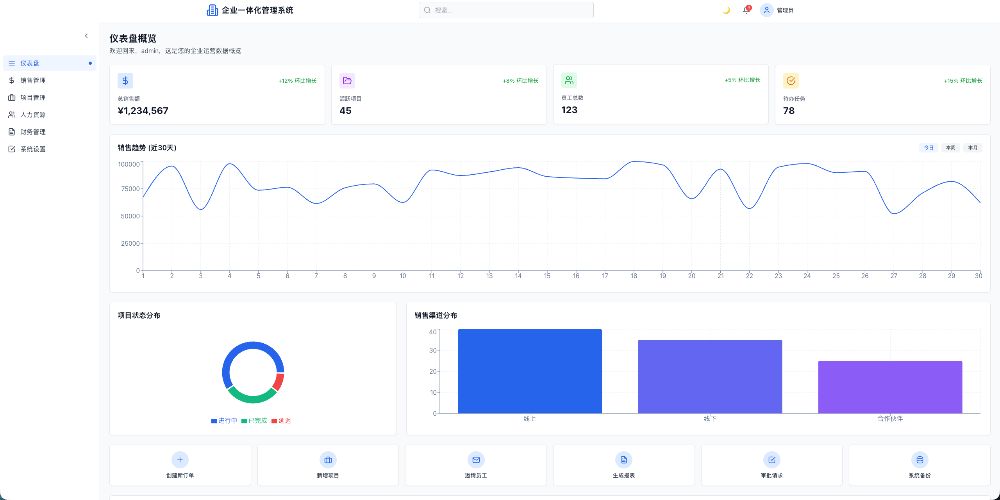
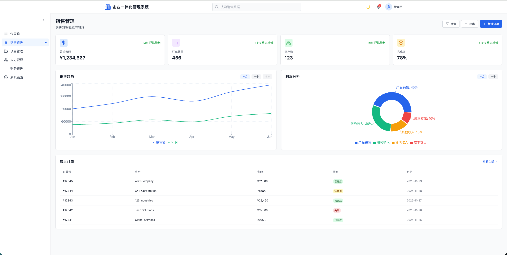
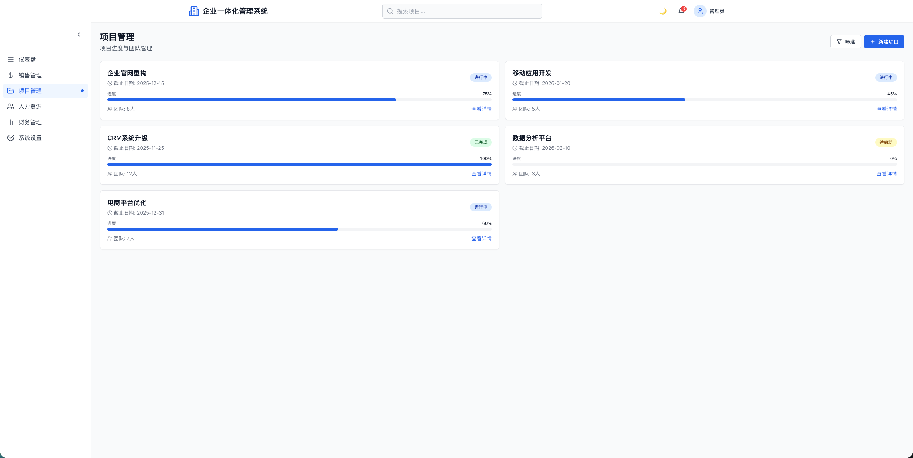
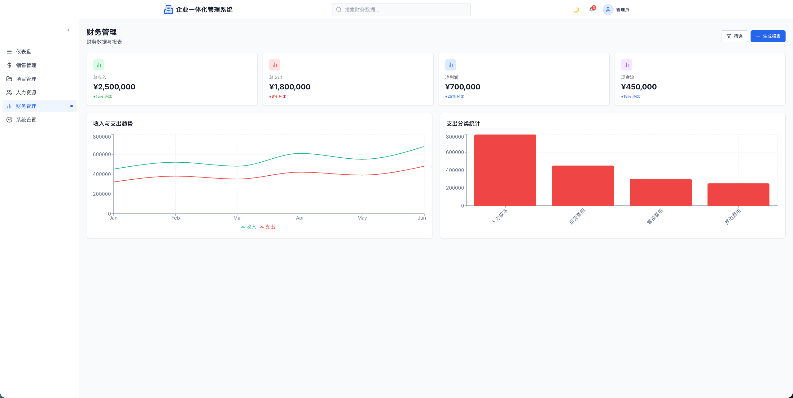
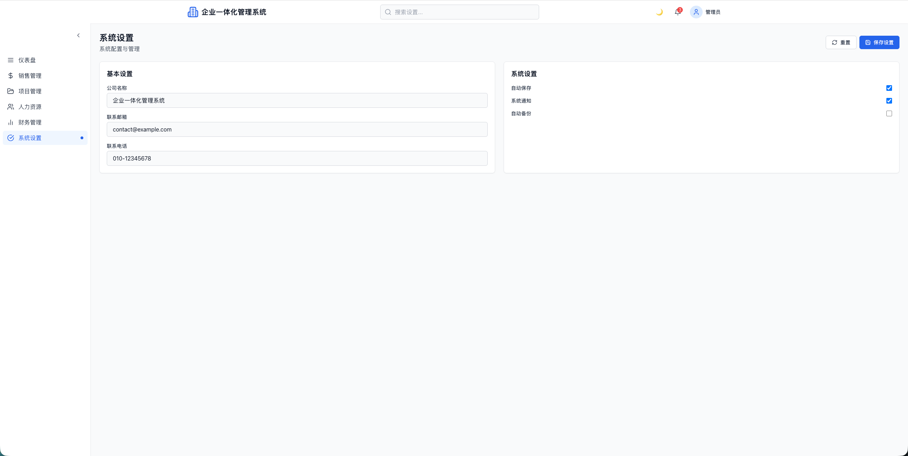

# 企业一体化管理系统

> 基于 React + TypeScript 构建的现代化企业管理系统，集成了销售、项目、人力资源、财务等核心业务模块，为企业提供统一的数据管理和可视化分析平台。

[](https://github.com/Pytorchlover/enterprise-core-platform)
[](https://react.dev/)
[](https://www.typescriptlang.org/)
[](https://vitejs.dev/)
[](https://tailwindcss.com/)

---

## 📋 目录

- [项目简介](#-项目简介)
- [功能特性](#-功能特性)
- [页面展示](#-页面展示)
- [技术栈](#-技术栈)
- [快速开始](#-快速开始)
- [项目结构](#-项目结构)
- [功能模块](#-功能模块)
- [在线体验](#-在线体验)
- [开发工具](#-开发工具)

---

## 🎯 项目简介

企业一体化管理系统是一个功能完善的企业级管理平台，旨在通过现代化的技术手段，帮助企业实现业务数据的统一管理和可视化分析。系统集成了销售管理、项目管理、人力资源管理、财务管理等核心业务模块，提供了丰富的数据可视化功能，支持深色/浅色主题切换，完美适配桌面端和移动端。

### 核心特点

- ✅ **模块化架构**：清晰的业务模块划分，易于扩展和维护
- ✅ **数据可视化**：丰富的图表展示，直观呈现业务数据
- ✅ **现代化 UI**：采用 Tailwind CSS 构建，支持深色/浅色主题
- ✅ **响应式设计**：完美适配桌面端和移动端设备
- ✅ **权限管理**：完善的登录认证和路由保护机制
- ✅ **流畅动画**：使用 Framer Motion 实现流畅的交互动画

---

## ✨ 功能特性

### 🔐 用户认证

- 用户注册和登录
- 基于 Context API 的全局状态管理
- 路由级别的权限保护
- 登录状态持久化（localStorage）
- 自动恢复登录状态

### 📊 仪表盘（Dashboard）

- 数据概览卡片（总销售额、活跃项目、员工总数、待办任务）
- 销售趋势折线图（近30天数据）
- 项目状态分布饼图
- 销售渠道分布柱状图
- 快速操作区
- 最近动态时间线

### 💰 销售管理

- 销售数据概览统计
- 销售趋势分析图表（销售额 + 利润双线图）
- 利润分析饼图（产品销售、服务收入等）
- 订单管理列表
- 订单状态跟踪

### 📁 项目管理

- 项目列表展示
- 项目状态管理
- 项目进度跟踪

### 👥 人力资源管理

- 员工信息管理
- 部门分类
- 员工状态跟踪

### 💵 财务管理

- 财务数据概览（总收入、总支出、净利润、现金流）
- 收入与支出趋势图
- 支出分类统计柱状图

### ⚙️ 系统设置

- 基本设置（公司信息配置）
- 系统设置（自动保存、通知、备份等开关）
- 主题切换

---

## 📸 页面展示

### 仪表盘（Dashboard）



仪表盘提供企业运营数据的全面概览，包含多种可视化图表和关键指标统计。

**主要功能：**
- 数据概览卡片：总销售额、活跃项目、员工总数、待办任务
- 销售趋势折线图：展示近30天的销售数据变化趋势
- 项目状态分布饼图：直观展示进行中、已完成、延迟项目的占比
- 销售渠道分布柱状图：分析不同销售渠道的贡献度
- 快速操作区：提供创建订单、新增项目、邀请员工等快捷操作
- 最近动态：展示系统内的最新活动记录

### 销售管理（Sales）



销售管理模块提供完整的销售数据分析和订单管理功能，支持销售趋势分析和利润分析。

**主要功能：**
- 销售数据统计：总销售额、订单数量、客户数、完成率等关键指标
- 销售趋势分析：双线图表展示销售额和利润的变化趋势
- 利润分析饼图：展示产品销售、服务收入、其他收入、成本支出的分布
- 订单管理列表：完整的订单信息，包括订单号、客户、金额、状态、日期

### 项目管理（Projects）



项目管理模块帮助团队跟踪和管理项目进度，清晰展示项目状态和详细信息。

**主要功能：**
- 项目列表展示：查看所有项目的概览信息
- 项目详情查看：深入了解每个项目的详细信息
- 项目状态跟踪：实时跟踪项目进度和状态
- 项目进度管理：可视化展示项目完成进度

### 财务管理（Finance）



财务管理模块提供财务数据的可视化分析，包括收入支出趋势和分类统计。

**主要功能：**
- 财务数据概览：总收入、总支出、净利润、现金流等关键指标
- 收入与支出趋势图：双线图表展示财务变化趋势，绿色表示收入，红色表示支出
- 支出分类统计柱状图：清晰展示人力成本、运营费用、营销费用、其他费用的分布

### 系统设置（Settings）



系统设置模块支持系统配置和个性化设置，满足不同企业的使用需求。

**主要功能：**
- 基本设置：配置公司名称、联系邮箱、联系电话等基本信息
- 系统设置：控制自动保存、系统通知、自动备份等系统功能的开关
- 主题切换：在深色和浅色主题之间无缝切换

---

## 🛠 技术栈

### 核心框架

- **React 18.3.1** - 用于构建用户界面的 JavaScript 库
- **TypeScript 5.3.3** - 提供类型安全的 JavaScript 超集
- **Vite 6.2.0** - 下一代前端构建工具

### UI 框架

- **Tailwind CSS 3.4.17** - 实用优先的 CSS 框架
- **Framer Motion 12.9.2** - 强大的动画库
- **Lucide React 0.338.0** - 现代化的图标库

### 路由与状态

- **React Router 7.3.0** - 声明式路由管理
- **Context API** - 轻量级全局状态管理

### 数据可视化

- **Recharts 2.15.1** - 基于 React 的图表库
  - 折线图、柱状图、饼图等多种图表类型
  - 支持响应式和主题切换

### 工具库

- **Sonner 2.0.2** - 优雅的 Toast 通知组件
- **clsx 2.1.1** - 用于条件性构造 className 的工具
- **tailwind-merge 3.0.2** - 智能合并 Tailwind CSS 类名

---

## 🚀 快速开始

### 环境要求

- **Node.js** >= 18.0.0
- **pnpm** >= 8.0.0（推荐）或 npm >= 9.0.0

### 安装步骤

#### 1. 克隆项目

```bash
git clone https://github.com/Pytorchlover/enterprise-core-platform.git
cd enterprise-core-platform

# 或者直接下载并解压项目
```

#### 2. 安装依赖

使用 pnpm（推荐）：

```bash
pnpm install
```

或使用 npm：

```bash
npm install
```

#### 3. 启动开发服务器

```bash
# 使用 pnpm
pnpm run dev

# 或使用 npm
npm run dev
```

#### 4. 访问应用

打开浏览器访问：**http://localhost:3000**

### 构建生产版本

```bash
# 构建
pnpm run build

# 预览构建结果
pnpm run preview
```

构建产物将输出到 `dist/static` 目录。

---

## 📁 项目结构

```
code/
├── assets/                 # 静态资源（图片等）
│   ├── 仪表盘.png
│   ├── 销售管理.png
│   ├── 项目管理.png
│   ├── 财务管理.png
│   └── 系统设置.png
├── src/
│   ├── components/         # 公共组件
│   │   ├── ProtectedRoute.tsx   # 路由保护组件
│   │   └── Empty.tsx            # 空状态组件
│   ├── contexts/          # Context 上下文
│   │   └── authContext.ts       # 认证上下文
│   ├── hooks/             # 自定义 Hooks
│   │   └── useTheme.ts          # 主题切换 Hook
│   ├── lib/               # 工具库
│   │   ├── api.ts              # API 接口
│   │   └── utils.ts            # 工具函数
│   ├── pages/             # 页面组件
│   │   ├── Home.tsx            # 首页
│   │   ├── Login.tsx           # 登录页
│   │   ├── Register.tsx        # 注册页
│   │   ├── Dashboard.tsx       # 仪表盘
│   │   ├── Sales.tsx           # 销售管理
│   │   ├── Projects.tsx        # 项目管理
│   │   ├── HR.tsx              # 人力资源管理
│   │   ├── Finance.tsx         # 财务管理
│   │   └── Settings.tsx        # 系统设置
│   ├── App.tsx            # 应用入口组件
│   ├── main.tsx           # 应用启动文件
│   └── index.css          # 全局样式
├── package.json           # 项目配置
├── vite.config.ts         # Vite 配置
├── tailwind.config.js     # Tailwind 配置
├── tsconfig.json          # TypeScript 配置
└── README.md              # 项目说明文档
```

---

## 🎨 功能模块

### 1. 认证系统

- 用户登录/注册
- 基于 Context API 的全局认证状态管理
- 路由级别的权限保护（ProtectedRoute）
- 登录状态持久化存储
- 自动恢复登录状态，避免刷新丢失

### 2. 仪表盘

- **数据概览卡片**
  - 总销售额
  - 活跃项目数
  - 员工总数
  - 待办任务数

- **数据可视化**
  - 销售趋势折线图（近30天）
  - 项目状态分布饼图
  - 销售渠道分布柱状图

- **快速操作**
  - 创建新订单
  - 新增项目
  - 邀请员工
  - 生成报表
  - 审批请求
  - 系统备份

- **最近动态**
  - 活动时间线展示

### 3. 销售管理

- 销售数据统计（总销售额、订单数量、客户数、完成率）
- 销售趋势分析（销售额和利润双线图表）
- 利润分析饼图（产品销售、服务收入、其他收入、成本支出）
- 订单管理列表（订单号、客户、金额、状态、日期）

### 4. 项目管理

- 项目列表展示
- 项目详情查看
- 项目状态跟踪
- 项目进度管理

### 5. 人力资源管理

- 员工列表展示
- 员工信息管理
- 部门分类筛选
- 员工状态跟踪（在职、请假等）

### 6. 财务管理

- 财务数据概览
  - 总收入
  - 总支出
  - 净利润
  - 现金流

- 数据可视化
  - 收入与支出趋势图（双线图表）
  - 支出分类统计柱状图（人力成本、运营费用、营销费用、其他费用）

### 7. 系统设置

- **基本设置**
  - 公司名称
  - 联系邮箱
  - 联系电话

- **系统设置**
  - 自动保存
  - 系统通知
  - 自动备份

---

## 🌐 在线体验

### 项目地址

🔗 **GitHub 仓库**：[https://github.com/Pytorchlover/enterprise-core-platform](https://github.com/Pytorchlover/enterprise-core-platform)

🔗 **在线访问**：https://space.coze.cn/task/7577993168512303379

### 本项目由 [网站开发专家](https://space.coze.cn/) 创建

---

## 🔧 开发工具

本项目在开发过程中使用了以下工具：

### 1. Coze 平台

- **工具简介**：字节跳动推出的 AI 应用开发平台
- **使用场景**：
  - 项目创建和初始化
  - 代码生成和辅助开发
  - 应用部署和管理

### 2. 豆包编程模型

- **工具简介**：豆包推出的代码生成模型
- **使用场景**：
  - 根据提示词生成代码
  - 快速构建页面组件
  - 优化代码实现

### 3. 火山引擎 veCLI

- **工具简介**：火山引擎提供的命令行工具
- **使用场景**：
  - 项目构建和部署
  - 代码优化和完善

---

## 📝 使用说明

### 登录系统

1. 访问应用首页
2. 点击"登录"按钮
3. 输入用户名和密码（当前为演示模式，任意输入即可）
4. 登录成功后自动跳转到仪表盘

### 导航使用

- **侧边栏导航**：点击左侧菜单项切换不同模块
- **侧边栏折叠**：点击侧边栏顶部的箭头按钮收起/展开
- **主题切换**：点击右上角的主题按钮切换深色/浅色模式

### 数据查看

- 所有图表支持鼠标悬停查看详细数据
- 可以通过图表上方的按钮切换时间范围
- 数据概览卡片实时显示关键指标

---

## ⚙️ 配置说明

### 路径别名

项目配置了路径别名 `@/`，指向 `src/` 目录，方便导入：

```typescript
import { useAuth } from '@/contexts/authContext';
import Dashboard from '@/pages/Dashboard';
```

### 主题配置

主题切换通过 `useTheme` Hook 实现，支持：
- 浅色模式（light）
- 深色模式（dark）
- 主题状态持久化存储

### 图表主题

所有图表组件都支持主题切换，会自动适配当前的主题模式。

---

## 🐛 已知问题

- 当前版本为演示版本，所有数据均为模拟数据
- 登录功能为演示模式，未对接真实后端 API
- 业务操作（创建订单、新增项目等）目前仅显示提示

---

## 🔮 未来规划

- [ ] 对接后端 API，实现数据持久化
- [ ] 实现基于角色的权限控制（RBAC）
- [ ] 添加数据导出功能（PDF、Excel）
- [ ] 集成实时通知系统（WebSocket）
- [ ] 开发移动端原生应用
- [ ] 添加数据大屏功能
- [ ] 支持国际化（i18n）
- [ ] 性能优化（代码分割、懒加载）

---

## 📄 许可证

本项目由 [网站开发专家](https://space.coze.cn/) 创建，用于学习和演示目的。

---

---

## 🙏 致谢

感谢以下开源项目和技术社区的支持：

- [React](https://react.dev/)
- [TypeScript](https://www.typescriptlang.org/)
- [Vite](https://vitejs.dev/)
- [Tailwind CSS](https://tailwindcss.com/)
- [Recharts](https://recharts.org/)
- [Framer Motion](https://www.framer.com/motion/)
- [Coze 平台](https://www.coze.cn/)

---

---

## ⭐ Star History

如果这个项目对你有帮助，欢迎 Star 支持！

[](https://star-history.com/#Pytorchlover/enterprise-core-platform&Date)

---

**⭐ 如果这个项目对你有帮助，欢迎 Star 支持！**

- 🌟 [GitHub 仓库](https://github.com/Pytorchlover/enterprise-core-platform)
- 🔗 [在线体验](https://space.coze.cn/task/7577993168512303379)
